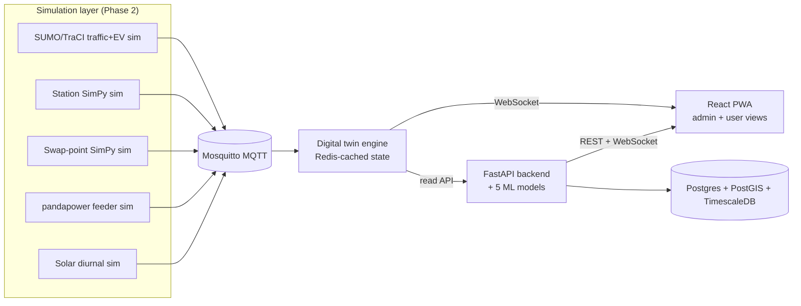

# Architecture

## System overview

MQTT topic namespaces: `ev/telemetry/{id}`, `charger/status/{id}`,
`swap/status/{id}`, `feeder/load/{id}`, plus `station/solar/{id}` for the
solar generation simulator (Section 5.3's solar-synced charging module).

## Simulation layer

Six independent processes (Docker Compose services `sim-city`, `sim-corridor`,
`sim-station`, `sim-swap`, `sim-grid`, `sim-solar`) generate all simulated
telemetry, communicating only over MQTT:

- `sim-city` / `sim-corridor` (`traci_bridge.py`) drive two SUMO scenarios
  built from real OpenStreetMap extracts (Overpass API): a dense Koramangala,
  Bengaluru city scenario (~800 routed vehicles/30min) and a sparse NH48
  highway-corridor scenario (~65 long-distance routed vehicles/30min) sized
  to demonstrate range anxiety. Each SUMO vehicle is deterministically mapped
  to an EV profile (class/connector/chemistry/pluggable) and its simulated
  battery depletes with distance travelled.
- `sim-station` (`station_sim.py`) runs a SimPy queueing model per station
  type (public DC hub, highway corridor, housing-society AC) and implements
  the reported-vs-verified trust layer: `last_verified_at` only refreshes on
  a genuine verification event (a vehicle actually starting a session), so a
  charger can report `status: available` with stale verification.
- `sim-swap` (`swap_sim.py`) models battery-swap kiosks as a `SimPy.Container`
  of ready batteries; a swap blocks only once the ready pool is empty,
  turnaround is sub-2-minutes, and recharging happens in the background.
- `sim-grid` (`grid_sim.py`) runs one independent pandapower network per
  feeder, fed by live aggregated charger/swap draw read off MQTT, so one
  feeder can overload without affecting siblings.
- `sim-solar` (`solar_sim.py`) publishes a diurnal generation curve for every
  site with `has_solar=True`.

Regenerating the SUMO scenario artifacts (`.net.xml`/`.rou.xml`, committed to
the repo so `docker compose up` needs no internet) requires `netconvert`,
`randomTrips.py`, and `duarouter` from the `sim-city`/`sim-corridor` image -
see the commands in this repo's commit history for the exact invocation.

## Build order

The stack is built in the order below; each phase depends on the previous
one producing real (simulated) data, not mocks. See the top-level
`CLAUDE_CODE_MASTER_PROMPT_CPS.md` build contract for full acceptance
criteria per phase.

1. Repo skeleton + Docker Compose skeleton
2. Simulation layer (SUMO, SimPy, pandapower, MQTT)
3. Digital twin engine
4. Database + core backend CRUD
5. AI/ML layer (5 core models)
6. Beyond-scope modules (Section 5)
7. Frontend
8. DevOps polish
9. Docs

## Data model

See `infra/postgres/init.sql` for extensions and the SQLAlchemy models under
`backend/app/models/` (Phase 4) for the concrete schema matching the ER
diagram in the build contract, Section 8.

## Digital twin engine

`twin-engine` subscribes to all five MQTT namespaces, caches the latest
payload per entity in Redis at `twin:{entity_type}:{entity_id}`, and exposes
`GET /state/{entity_type}`, `GET /state/{entity_type}/{entity_id}`, and a
`/ws` WebSocket that broadcasts every update as it arrives.

Deliberately **one Redis round-trip per message** (a bare `SET`, no separate
index write): an earlier version also maintained a Redis SET index via
`SADD` for fast listing, and under the ~100+ msgs/sec the simulation layer
produces, that second blocking call was enough to build an unbounded
backlog on Docker Desktop's WSL2-virtualized networking, delaying delivery
by minutes instead of the required <1s. Listing now uses `SCAN` over the
`twin:{entity_type}:*` key pattern instead of maintaining a second write.

`sim-city`/`sim-corridor` also pace SUMO steps to real time
(`--realtime-factor`, default 1.0) rather than stepping as fast as the CPU
allows - both because a "live" twin should track real elapsed time, and
because uncapped stepping was itself the original source of the message
flood above.

## Data flow guarantee

Twin state must reflect the underlying MQTT message within 1 second in all
automated tests (see `twin-engine/tests/test_live_latency.py`, which runs
against a live `docker compose up` stack and is skipped otherwise).
