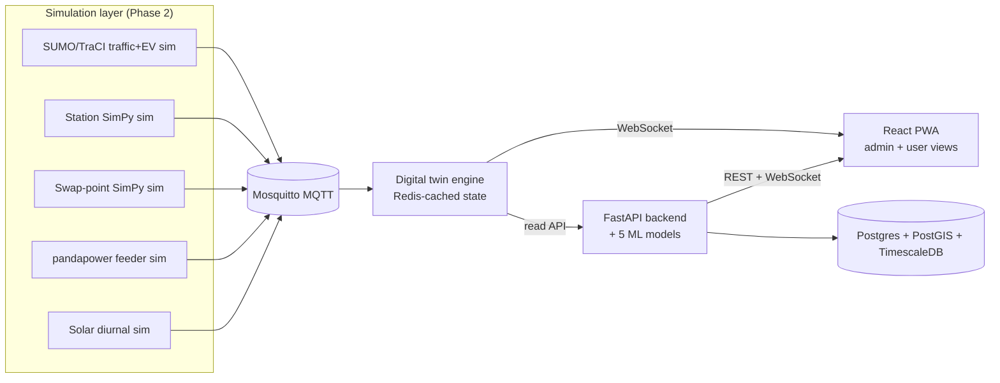

# Architecture

## System overview

MQTT topic namespaces: `ev/telemetry/{id}`, `charger/status/{id}`,
`swap/status/{id}`, `feeder/load/{id}`.

## Build order

The stack is built in the order below; each phase depends on the previous
one producing real (simulated) data, not mocks. See the top-level
`CLAUDE_CODE_MASTER_PROMPT_CPS.md` build contract for full acceptance
criteria per phase.

1. Repo skeleton + Docker Compose skeleton
2. Simulation layer (SUMO, SimPy, pandapower, MQTT)
3. Digital twin engine
4. Database + core backend CRUD
5. AI/ML layer (5 core models)
6. Beyond-scope modules (Section 5)
7. Frontend
8. DevOps polish
9. Docs

## Data model

See `infra/postgres/init.sql` for extensions and the SQLAlchemy models under
`backend/app/models/` (Phase 4) for the concrete schema matching the ER
diagram in the build contract, Section 8.

## Data flow guarantee

Twin state must reflect the underlying MQTT message within 1 second in all
automated tests (see `twin-engine` test suite, Phase 3).
