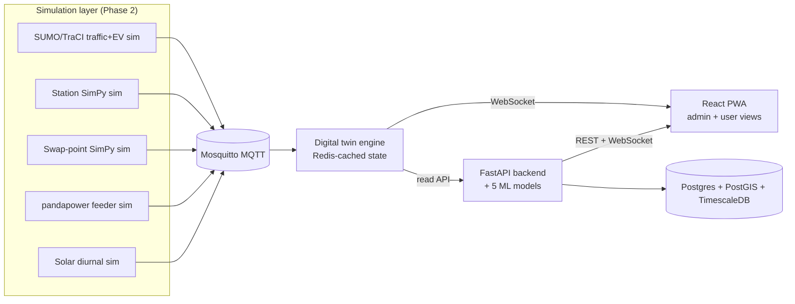

# Architecture

## System overview

MQTT topic namespaces: `ev/telemetry/{id}`, `charger/status/{id}`,
`swap/status/{id}`, `feeder/load/{id}`, plus `station/solar/{id}` for the
solar generation simulator (Section 5.3's solar-synced charging module).

## Simulation layer

Six independent processes (Docker Compose services `sim-city`, `sim-corridor`,
`sim-station`, `sim-swap`, `sim-grid`, `sim-solar`) generate all simulated
telemetry, communicating only over MQTT:

- `sim-city` / `sim-corridor` (`traci_bridge.py`) drive two SUMO scenarios
  built from real OpenStreetMap extracts (Overpass API): a dense Koramangala,
  Bengaluru city scenario (~800 routed vehicles/30min) and a sparse NH48
  highway-corridor scenario (~65 long-distance routed vehicles/30min) sized
  to demonstrate range anxiety. Each SUMO vehicle is deterministically mapped
  to an EV profile (class/connector/chemistry/pluggable) and its simulated
  battery depletes with distance travelled.
- `sim-station` (`station_sim.py`) runs a SimPy queueing model per station
  type (public DC hub, highway corridor, housing-society AC) and implements
  the reported-vs-verified trust layer: `last_verified_at` only refreshes on
  a genuine verification event (a vehicle actually starting a session), so a
  charger can report `status: available` with stale verification.
- `sim-swap` (`swap_sim.py`) models battery-swap kiosks as a `SimPy.Container`
  of ready batteries; a swap blocks only once the ready pool is empty,
  turnaround is sub-2-minutes, and recharging happens in the background.
- `sim-grid` (`grid_sim.py`) runs one independent pandapower network per
  feeder, fed by live aggregated charger/swap draw read off MQTT, so one
  feeder can overload without affecting siblings.
- `sim-solar` (`solar_sim.py`) publishes a diurnal generation curve for every
  site with `has_solar=True`.

Regenerating the SUMO scenario artifacts (`.net.xml`/`.rou.xml`, committed to
the repo so `docker compose up` needs no internet) requires `netconvert`,
`randomTrips.py`, and `duarouter` from the `sim-city`/`sim-corridor` image -
see the commands in this repo's commit history for the exact invocation.

## Build order

The stack is built in the order below; each phase depends on the previous
one producing real (simulated) data, not mocks. See the top-level
`CLAUDE_CODE_MASTER_PROMPT_CPS.md` build contract for full acceptance
criteria per phase.

1. Repo skeleton + Docker Compose skeleton
2. Simulation layer (SUMO, SimPy, pandapower, MQTT)
3. Digital twin engine
4. Database + core backend CRUD
5. AI/ML layer (5 core models)
6. Beyond-scope modules (Section 5)
7. Frontend
8. DevOps polish
9. Docs

## Data model

See `infra/postgres/init.sql` for extensions and the SQLAlchemy models under
`backend/app/models/` (Phase 4) for the concrete schema matching the ER
diagram in the build contract, Section 8.

## Digital twin engine

`twin-engine` subscribes to all five MQTT namespaces, caches the latest
payload per entity in Redis at `twin:{entity_type}:{entity_id}`, and exposes
`GET /state/{entity_type}`, `GET /state/{entity_type}/{entity_id}`, and a
`/ws` WebSocket that broadcasts every update as it arrives.

Deliberately **one Redis round-trip per message** (a bare `SET`, no separate
index write): an earlier version also maintained a Redis SET index via
`SADD` for fast listing, and under the ~100+ msgs/sec the simulation layer
produces, that second blocking call was enough to build an unbounded
backlog on Docker Desktop's WSL2-virtualized networking, delaying delivery
by minutes instead of the required <1s. Listing now uses `SCAN` over the
`twin:{entity_type}:*` key pattern instead of maintaining a second write.

`sim-city`/`sim-corridor` also pace SUMO steps to real time
(`--realtime-factor`, default 1.0) rather than stepping as fast as the CPU
allows - both because a "live" twin should track real elapsed time, and
because uncapped stepping was itself the original source of the message
flood above.

## Backend

FastAPI + SQLAlchemy + PostgreSQL/PostGIS/TimescaleDB, implementing the
Section 8 data model exactly, with one documented extension: `USERS` gains
`email`/`hashed_password` since the ERD has no login-credential fields at
all but Section 9.4 requires JWT auth. JWT auth via `python-jose` +
`passlib[bcrypt]` (pinned to `bcrypt==4.0.1` - newer bcrypt releases dropped
an attribute passlib 1.7.4's self-test depends on). The backend is the only
service frontend clients talk to: it proxies read-only twin state
(`GET /twin/{type}`, `GET /twin/{type}/{id}`) and relays twin-engine's
WebSocket feed at `/ws/live`, so `twin-engine` itself stays internal-only.

## AI / optimization layer (`backend/ml/`)

Five independently testable models (Section 4.5), each with a stated
acceptance metric proven by a real, runnable test - not asserted:

1. **`demand_forecast.py`** - XGBoost (via the CPU-only `xgboost-cpu`
   package; the default `xgboost` wheel pulls in an unused ~300MB
   `nvidia-nccl-cu12` CUDA dependency even for CPU inference) trained on
   synthetic session history shaped like real logs, evaluated on a
   chronologically held-out slice (not a random split - this is a
   forecasting problem). MAE/RMSE bounds reflect the Poisson sampling
   noise floor in the data, not an arbitrary target.
2. **`recommendation.py`** - filters for connector/chemistry compatibility
   and excludes non-pluggable vehicles *before* ranking, applies the
   reported-vs-verified trust penalty, and is proven to beat a naive
   distance-only baseline on a constructed scenario (nearby-but-stale vs.
   farther-but-trustworthy).
3. **`charge_controller.py`** - OR-Tools CP-SAT, a genuine discretized
   control problem: chooses a power level per minute subject to a hard
   simulated cell-temperature ceiling (integer thermal recurrence, scaled
   to tenths of a degree) that is never violated, while minimizing a soft
   degradation-cost term. Reaches a 90 kWh target (10%->80% of a large
   fast-charge-capable pack) in 14 minutes, inside the spec's 13-15 minute
   window, with lower total degradation than a naive constant-current
   baseline reaching the target in the same time. A separate adversarial
   test with a tightened ceiling proves the hard constraint actually forces
   throttling, not just theoretically exists.
4. **`battery_health.py`** - SoH kept wholly separate from SoC in every
   return type. RUL projection blends a vehicle's own degradation slope
   with a population slope from other twins sharing the same chemistry and
   vehicle class (empirical-Bayes shrinkage, weighted by the vehicle's own
   sample count) - a real SQL query against `BatteryHealth`/`Vehicle`, not
   a comment. Proven to measurably sharpen the RUL estimate for a vehicle
   with thin/noisy history versus using that vehicle's own data alone.
5. **`fleet_scheduler.py`** - OR-Tools CP-SAT interval scheduling
   (`NewOptionalIntervalVar` + `AddNoOverlap` per charger +
   `AddCumulative` for the shared feeder limit), a structurally different
   formulation from the recommender's weighted scoring (checked by a test
   that parses the module's AST and asserts it never imports
   `recommendation`). Achieves lower peak simultaneous draw than naively
   looping independent per-vehicle assignment at equal service level, and
   respects a feeder capacity cap that the naive approach would violate.

Two real bugs were caught and fixed during Phase 5 by the tests, not by
code review: `charge_controller.py`'s original thermal coefficient implied
120 C/minute of heating at 400 kW, making every nonzero power level
thermally infeasible (the solver was correctly solving a broken model);
and `fleet_scheduler.py`'s naive baseline had a dead `and`-expression that
always picked the same charger, plus an unbounded `start` variable that let
sessions run past the depot's operating window.

## Beyond-scope modules (Section 5)

Ten of the twelve Section 5 modules are backend services with their own
`ml/` module, tests, and API endpoint - each a genuinely separate piece,
not folded into an existing one:

| Module | Code | Endpoint |
|---|---|---|
| V2G/V2H dispatch | `ml/v2g_dispatch.py` | `POST /v2g/dispatch` |
| Blackout resilience | `ml/blackout_resilience.py` (built on v2g_dispatch) | `POST /blackout/plan` |
| Solar-synced charging | `ml/solar_sync.py` | `POST /solar-sync/recommend` |
| Safety score | `ml/safety_score.py`, wired into `ml/recommendation.py` | `POST /recommendations` |
| Emergency priority queue | `ml/emergency_queue.py` | `POST /emergency-queue/insert` |
| Mass-gathering stress test | `ml/event_stress_test.py` (analysis) + `simulation/event_stress_sim.py` (live burst) | `POST /stress-test/sweep` |
| Simulated UPI payment | `ml/upi_simulator.py` | `POST /payments/sessions/{id}/initiate`, `POST /payments/{ref}/confirm` |
| Carbon/ESG tracking | `ml/carbon_ledger.py`, wired into session completion | `GET /carbon-ledger/...` (Phase 4) |
| Predictive maintenance | `ml/maintenance_predictor.py`, feeds `Charger.maintenance_risk_score` | `POST /stations/chargers/{id}/maintenance-check` |
| Rural mini-grid mode | `ml/rural_minigrid.py` | capacity-planning function, no dedicated endpoint (used by admin tooling in Phase 7) |
| What-if all-EV mode (Section 4.6) | `ml/event_stress_test.py::what_if_all_ev` | `POST /what-if/all-ev` |

The remaining two - multilingual/low-literacy frontend and offline-first
PWA behavior - are frontend-layer concerns with no backend component;
they're built in Phase 7 alongside the rest of the UI.

`event_stress_sim.py` is invoked on-demand against the `sim-station` image
rather than as an always-running compose service, matching Section 5.6's
"admin-triggerable disaster scenario" framing:
`docker compose run --rm sim-station python event_stress_sim.py --station-id <id> --density-multiplier 5 --burst-minutes 30`.

## Frontend (`frontend-web/`)

React 19 + TypeScript + Vite, Tailwind CSS v4, react-router-dom, react-i18next
(English + Hindi, key-parity enforced by a test), Leaflet/react-leaflet for
the live map, Recharts for the admin dashboard, and `vite-plugin-pwa` for
offline-first behavior (`NetworkFirst` caching on `/stations`, `/feeders`,
`/twin/*` - the last-known station/feeder list stays available read-only
with no network, per Section 5.8).

The frontend talks only to the backend - `twin-engine` stays internal-only.
Live data (EV positions, feeder load) comes over the backend's `/ws/live`
relay; static data (stations, vehicles, sessions) over REST.

Persona-based default views (Section 4.1): `city_admin` lands on `/admin`,
`fleet_operator` on `/vehicles`, everyone else on `/map` - a real routing
difference, not a theme swap. The nav bar itself also differs by persona
(admins don't see "My Vehicles"/"Sessions"; non-admins don't see "City
Admin").

Verified end-to-end against the live stack in the browser, not just built:
register → add vehicle → start/complete a session → carbon ledger entry
appears → simulated UPI payment → confirm. Separately as `city_admin`:
demand-forecast chart, live grid-stress view (real feeder data flowing
sim → MQTT → twin-engine → backend → frontend), and the mass-gathering
stress-test trigger, all producing real numbers from real backend calls.

A real bug surfaced during this verification and was fixed: the backend
had no CORS middleware, so the browser's preflight `OPTIONS` request to
`/auth/register` failed with 405 before a single form ever worked.

## Observability

The backend exposes Prometheus metrics at `/metrics` via
`prometheus-fastapi-instrumentator` (request rate, latency histograms,
status codes, all labeled by handler). Prometheus scrapes it every 15s;
Grafana auto-provisions a Prometheus datasource and a "Backend API"
dashboard (`infra/grafana/provisioning/`) with request-rate, error-rate,
p95-latency, and total-requests panels - verified against a live stack by
generating traffic and confirming the dashboard's underlying PromQL
queries return real, non-zero data, not just that the panels render.

## Data flow guarantee

Twin state must reflect the underlying MQTT message within 1 second in all
automated tests (see `twin-engine/tests/test_live_latency.py`, which runs
against a live `docker compose up` stack and is skipped otherwise).
